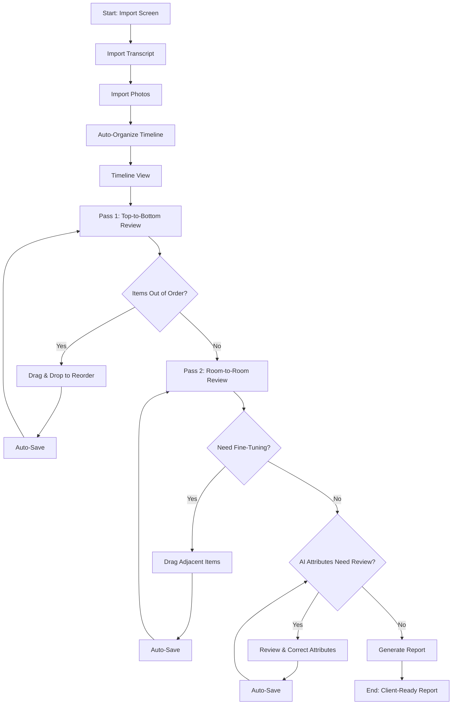
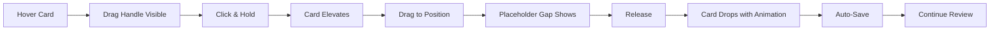

# TimelineMerge UX Design Specification

_Created on 2025-11-01 by David_
_Generated using BMad Method - Create UX Design Workflow v1.0_

---

## Executive Summary

TimelineMerge is an intelligent timeline-based documentation tool that transforms property damage inspection workflows by automatically organizing transcript excerpts and photos chronologically, using AI to extract location context, and generating professional client-ready reports.

**Target Users:** Property damage inspectors who currently face tedious manual copy-paste workflows, managing large volumes of inspection data (up to 3,000 photos and 40 hours of transcripts) while maintaining chronological relationships between spoken observations and visual evidence.

**Platform:** Web application for desktop browsers (Chrome, Firefox, Safari, Edge)

**Technical Foundation:** Next.js, TypeScript, Tailwind CSS, ShadCN components, Supabase

---

## 1. Design System Foundation

### 1.1 Design System Choice

**Selected Foundation:** ShadCN/ui + Tailwind CSS (as specified in PRD)

**Version:** Tailwind CSS v4 (2025) with enhanced theming via CSS variables and OKLCH color space

**Customization Strategy:**

ShadCN/ui provides excellent component foundations (buttons, forms, modals, cards) with built-in accessibility, but we'll customize heavily to avoid the "standard ShadCN look":

1. **Custom Design Tokens**
   - Unique spacing scale (consider 6px base vs. standard 8px)
   - Custom typography scale optimized for text-heavy content
   - Distinctive border radius values
   - Custom shadow system for subtle depth

2. **OKLCH Color System**
   - More perceptually accurate colors than HSL/RGB
   - Better for accessibility and subtle color usage
   - Defined in CSS variables for easy theming

3. **Timeline-Specific Custom Components**
   - Timeline cards (transcript, photo, note) - built from scratch
   - Placeholder zones - custom interaction pattern
   - Drag handles and affordances - unique to TimelineMerge
   - Photo thumbnail/enlargement system - specialized component

4. **Animation Philosophy**
   - Subtle, purposeful animations only where they reduce cognitive load
   - Smooth transitions for state changes (card selection, reordering)
   - No gratuitous motion - complexity tradeoff acknowledged
   - Focus on polish, not showmanship

**Photo Handling Consideration:**

A critical UX challenge: mixing large photo thumbnails with text content on the timeline. Photos need to be:
- **Large enough to identify** (extra-large thumbnails, not tiny icons)
- **Easy to enlarge** (quick preview without leaving timeline context)
- **Visually balanced** with text items (consistent card treatment despite different content types)
- **Performant** (virtualization for 3,000+ photos)

**Design System Provides:**
- Form components, buttons, modals (via ShadCN)
- Accessible focus states, keyboard navigation patterns
- Semantic color tokens (primary, secondary, success, error, warning)
- Responsive utilities and layout primitives (via Tailwind)

**Custom Components Needed:**
- Timeline card variants (transcript, photo, note)
- Placeholder insertion zones
- Photo lightbox/enlargement
- Drag-and-drop affordances
- Location attribute badges
- Context-aware navigation controls

---

## 2. Core User Experience

### 2.1 Defining Experience

**Core Experience:** Timeline organization - dragging, reordering, and viewing items chronologically

**Platform:** Web application (desktop browsers - Chrome, Firefox, Safari, Edge)

**Primary User Action:** Reviewing the automatically-organized timeline of transcript excerpts and photos, then refining it through drag-and-drop reordering to create the perfect chronological narrative for the inspection report.

**What makes this unique:** Unlike traditional document editors or simple photo galleries, TimelineMerge maintains the critical temporal relationship between spoken observations and visual evidence, allowing inspectors to see their entire inspection unfold as a story on a single timeline.

**Desired Emotional Response:** Calm and focused, with a touch of enjoyment from using a slick, well-crafted tool.

Users should feel like the interface gets out of their way, allowing them to think clearly about the inspection itself rather than fighting with software. At the same time, smooth interactions, thoughtful micro-animations, and polished details should provide subtle moments of delight - the kind that makes someone think "this is a pleasure to use" and want to show colleagues.

**Design Direction Insights:**

- **Card-based timeline items** with clear visual hierarchy and breathing room
- **Placeholder zones** before/after each card for quick note insertion
- **Clear visual affordances** for movement and CRUD operations (no mystery meat navigation)
- **Text-heavy but spacious** - generous whitespace makes dense content scannable
- **Subtle, purposeful color** - not boring, but calm and professional
- **Beyond standard ShadCN** - use ShadCN components as foundation but customize for distinctive personality
- **Large screen optimization** - primary use case on large monitors, take advantage of horizontal space
- **Power-user interactions:**
  - Mouse wheel navigation while card selected
  - Keyboard shortcuts (move up/down one item, jump to end of room/section)
  - Contextual quick actions based on location attributes

### 2.2 Novel UX Patterns

**Pattern 1: Placeholder-Based Note Insertion**

Unlike traditional "add note" buttons that require modal dialogs or separate views, TimelineMerge displays subtle placeholder zones before and after every timeline card. Clicking a placeholder instantly creates a note in that exact position - maintaining flow and spatial context.

- **User Goal:** Add contextual notes without losing their place in the timeline
- **Trigger:** Click placeholder zone (or keyboard shortcut while card selected)
- **Feedback:** Placeholder expands into editable note card with focus
- **Success:** Note saved inline, timeline reflows smoothly
- **Rationale:** Inspectors think spatially - "I need to add a note before this photo" - placeholders match that mental model

**Pattern 2: Multi-Modal Card Movement**

The same reordering action can be performed three different ways, allowing users to choose based on context and preference:

- **Drag-and-drop:** Visual, intuitive for moving items short distances or to visible targets
- **Mouse wheel:** Precise, efficient when card is selected - scroll to move up/down incrementally
- **Keyboard shortcuts:** Fastest for power users - move one item, jump to section boundaries (e.g., "end of current room")

This flexibility respects different working styles and optimizes for both occasional and frequent users.

**Pattern 3: Context-Aware Timeline Navigation**

Leveraging AI-extracted location attributes (building/floor/unit/room/monitor point), the timeline isn't just chronological - it's spatially aware. Users can navigate by location hierarchy, not just time:

- "Jump to next room"
- "Move card to end of current unit"
- Visual grouping indicators show location boundaries
- Location attributes displayed prominently on each card for spatial orientation

This transforms a linear timeline into a spatially-organized narrative that mirrors how inspections actually happen.

---

## 3. Visual Foundation

### 3.1 Color System

**Chosen Theme:** Slate Calm

**Rationale:** Sophisticated cool gray neutrals with subtle blue accents provide the perfect balance for TimelineMerge. The theme is professional and unobtrusive, allowing users to focus on content rather than interface. Cool grays are easier on the eyes during long inspection review sessions, and the subtle blue accent provides just enough visual interest without being distracting.

**Color Palette:**

**Primary Colors:**
- Primary: `#475569` (Slate 600) - Main actions, headers, primary UI elements
- Secondary: `#64748b` (Slate 500) - Supporting elements, secondary text
- Accent: `#3b82f6` (Blue 500) - Interactive elements, focus states, links

**Semantic Colors:**
- Success: `#10b981` (Emerald 500) - Success states, confirmations
- Warning: `#f59e0b` (Amber 500) - Warnings, low-confidence AI extractions
- Error: `#ef4444` (Red 500) - Errors, destructive actions

**Neutral Grayscale:**
- Background: `#f8fafc` (Slate 50) - App background
- Surface: `#ffffff` - Card backgrounds, elevated surfaces
- Border: `#e2e8f0` (Slate 200) - Subtle borders, dividers
- Text Primary: `#334155` (Slate 700) - Main text content
- Text Secondary: `#94a3b8` (Slate 400) - Secondary text, timestamps, metadata

**Location Badge Colors:**
- Badge Background: `#eff6ff` (Blue 50) - Subtle highlight for location attributes
- Badge Text: `#3b82f6` (Blue 500) - Clear, readable location information

### 3.2 Typography System

**Font Families:**
- **Sans-serif (UI & Body):** -apple-system, BlinkMacSystemFont, 'Segoe UI', Roboto, 'Helvetica Neue', Arial, sans-serif
  - System font stack for optimal performance and native feel
  - Excellent readability for text-heavy content
- **Monospace (Timestamps, metadata):** 'SF Mono', 'Courier New', Consolas, monospace
  - Used sparingly for technical information

**Type Scale (optimized for text-heavy content):**
- **Display (H1):** 2rem / 32px - Page titles, import screen
- **Heading 1 (H2):** 1.5rem / 24px - Section headers
- **Heading 2 (H3):** 1.25rem / 20px - Subsection headers
- **Heading 3 (H4):** 1.125rem / 18px - Card headers
- **Body Large:** 1rem / 16px - Primary content in timeline cards
- **Body:** 0.9375rem / 15px - Standard UI text
- **Small:** 0.875rem / 14px - Secondary information
- **Tiny:** 0.75rem / 12px - Timestamps, metadata, badges

**Font Weights:**
- Regular (400) - Body text, descriptions
- Medium (500) - Buttons, labels, emphasis
- Semibold (600) - Headings, card headers
- Bold (700) - Used sparingly for critical emphasis

**Line Heights (optimized for readability):**
- Tight (1.25) - Headings
- Normal (1.5) - Body text in timeline cards (critical for transcript readability)
- Relaxed (1.625) - Long-form content

### 3.3 Spacing System

**Base Unit:** 6px (distinctive from standard 4px or 8px)

**Spacing Scale:**
- xs: 6px (1 unit) - Tight internal spacing
- sm: 12px (2 units) - Small gaps, compact layouts
- md: 18px (3 units) - Standard spacing between elements
- lg: 24px (4 units) - Generous breathing room
- xl: 36px (6 units) - Section separation
- 2xl: 48px (8 units) - Major layout divisions
- 3xl: 72px (12 units) - Page-level spacing

**Rationale for 6px base:** Creates a distinctive rhythm that feels slightly more spacious than standard systems, supporting the "text-heavy but spacious" requirement.

**Layout Grid:**
- Single-column timeline (primary view)
- Max content width: 1200px for optimal readability
- Horizontal padding: 24px (lg) on large screens, 18px (md) on medium, 12px (sm) on small

### 3.4 Border Radius & Shadows

**Border Radius:**
- sm: 4px - Small elements, badges
- md: 8px - Timeline cards, buttons
- lg: 12px - Modals, large containers
- full: 9999px - Pills, circular elements

**Shadow System (subtle depth cues):**
- sm: `0 1px 2px rgba(0, 0, 0, 0.05)` - Subtle lift for cards at rest
- md: `0 2px 8px rgba(0, 0, 0, 0.08)` - Elevated state, selected cards
- lg: `0 4px 16px rgba(0, 0, 0, 0.12)` - Modals, photo lightbox
- focus: `0 0 0 3px rgba(59, 130, 246, 0.15)` - Focus ring for accessibility

**Interactive Visualizations:**

- Color Theme Explorer: [ux-color-themes.html](./ux-color-themes.html)

---

## 4. Design Direction

### 4.1 Chosen Design Approach

**Selected Direction:** Horizontal Photo Thumbnails (Direction 5) with refinements

**Rationale:** The horizontal photo thumbnail layout provides the best balance for TimelineMerge's needs:
- **Space-efficient photo handling:** Multiple photos displayed as horizontal scrollable galleries saves vertical space while keeping photos prominent
- **Scannable timeline:** Single-column layout with consistent card treatment makes it easy to review long inspection timelines
- **Clear visual hierarchy:** Photos are prominent but don't dominate; text content remains readable
- **Flexible for mixed content:** Works well whether a section has one photo or multiple related images

**Layout Decisions:**

**Structure:**
- Single-column timeline, centered, max-width 1200px
- Consistent card treatment for all item types (transcript, photo, note)
- Horizontal photo galleries within cards for space efficiency

**Content Organization:**
- Cards with subtle borders and shadows for depth
- Location attributes displayed as badges in card headers
- Timestamps shown in monospace font for easy scanning

**Placeholder Note Insertion (Refined):**
- Minimal horizontal divider line between cards (1px, subtle gray)
- Small centered plus icon on hover to reveal add-note affordance
- Vertical space savings without sacrificing breathing room
- On hover: line brightens to accent color, plus icon fades in
- On click: expands inline to editable note card

**Interaction Decisions:**

**Primary Action Pattern:**
- Click photo thumbnail → Opens lightbox/full-size view (modal)
- Hover card → Shows drag handle and action buttons
- Select card → Enables keyboard shortcuts and mouse wheel navigation

**Information Disclosure:**
- Progressive: Actions hidden until hover to reduce visual clutter
- Location attributes always visible (critical context)
- Timestamps always visible (temporal orientation)

**User Control:**
- Multi-modal movement: drag-and-drop, mouse wheel, keyboard shortcuts
- Inline editing: click text to edit in place
- Contextual actions: relevant operations based on item type

**Visual Style Decisions:**

**Weight:** Balanced - not too minimal, not too heavy
- Clean cards with subtle borders
- Gentle shadows for depth cues
- Adequate whitespace without feeling sparse

**Depth Cues:**
- Subtle shadows at rest (sm)
- Elevated shadow on hover/selection (md)
- Strong shadow for modals/lightbox (lg)
- No heavy drop shadows or dramatic elevation

**Border Style:**
- Subtle borders (1px, #e2e8f0)
- Slightly thicker on selected cards (2px, accent color)
- Rounded corners (8px) for cards, softer feel

**Photo Handling Strategy:**

**Thumbnail Size:**
- Horizontal scroll: 200px wide × 120px tall per thumbnail
- Maintains aspect ratio, crops if needed
- Multiple photos displayed side-by-side

**Enlargement Interaction:**
- Click thumbnail → Modal lightbox overlay
- Full-size image centered, dark backdrop
- Click outside or ESC to close
- Arrow keys to navigate between photos in sequence
- No interruption to timeline context (returns to same scroll position)

**Performance Consideration:**
- Virtual scrolling for timeline with 3,000+ photos
- Lazy-load photo thumbnails as they enter viewport
- Low-res thumbnails initially, higher quality on hover (optional optimization)

**Interactive Mockups:**

- Design Direction Showcase: [ux-design-directions.html](./ux-design-directions.html)

---

## 5. User Journey Flows

### 5.1 Critical User Paths

Based on PRD analysis, TimelineMerge has four critical user journeys:

1. **Import Journey** - Import transcript + photos → See organized timeline
2. **Timeline Organization Journey** - Review → Refine → Perfect chronological narrative (CORE)
3. **AI Attribute Review Journey** - Review AI-extracted locations → Correct low-confidence items
4. **Report Generation Journey** - Preview → Generate final report

---

### 5.2 Journey 1: Import & Initial Organization

**User Goal:** Import inspection data and see it organized on the timeline

**Entry Point:** Landing/home screen with "New Inspection" or "Import Data" action

**Flow:**

1. **Select Transcript File**
   - User clicks "Import Transcript"
   - File picker dialog opens
   - User selects Otter.ai transcript file (.txt or supported format)
   - System parses: timestamps, speaker labels, text content
   - Feedback: "Transcript parsed - 127 items found"

2. **Select Photo Directory**
   - User clicks "Import Photos"
   - Directory picker opens
   - User selects folder containing inspection photos
   - System scans metadata: timestamps, EXIF data
   - Feedback: "Photos scanned - 42 photos found"
   - Note: Photos stay in original location (no file upload/storage)

3. **Process & Organize**
   - System uses timestamps to establish chronological order
   - Initial timeline displayed with all items sorted
   - Loading indicator shows progress
   - Success: "Timeline organized - 157 items ready for review"

4. **Navigate to Timeline View**
   - Automatic redirect to timeline workspace
   - All items visible, ready for refinement

**Success State:** Timeline displayed with chronologically ordered items

**Error Scenarios:**
- Invalid transcript format → Show error message, allow retry
- No photos found in directory → Warning, proceed with transcript only
- Timestamp parsing issues → Flag items for manual review

---

### 5.3 Journey 2: Timeline Organization (CORE EXPERIENCE)

**User Goal:** Review and refine the auto-organized timeline to create the perfect chronological narrative

**Entry Point:** Timeline view with all imported items

**User Behavior:** Mouse-heavy users, drag-and-drop primary method

**Flow Overview:** Two-pass approach
- **Pass 1:** Top-to-bottom review of entire timeline
- **Pass 2:** Room-to-room refinement for spatial accuracy

**Detailed Flow:**

**Pass 1: Initial Top-to-Bottom Review**

1. **Scroll and Review**
   - User scrolls from top of timeline
   - Scans each card: timestamp, location badges, content
   - Identifies items that seem out of chronological order
   - Visual cues: timestamps, location context help orient

2. **Identify Misplaced Item**
   - User notices item that doesn't belong in sequence
   - Example: Photo taken at 10:24 appears after 10:30 transcript

3. **Reorder via Drag-and-Drop**
   - User hovers over card → Drag handle becomes prominent
   - Clicks and holds on card or drag handle
   - Card elevates (visual feedback: higher shadow, slight scale)
   - Drag to correct position in timeline
   - Placeholder gap shows where card will land
   - Release → Card drops into position with smooth animation
   - Auto-save: Change saved immediately (no manual save needed)
   - Visual feedback: Subtle success indicator (optional)

4. **Continue Review**
   - User scrolls to next section
   - Repeats steps 2-3 as needed
   - Reaches end of timeline (first pass complete)

**Pass 2: Room-to-Room Refinement**

5. **Navigate to Specific Location**
   - User wants to review all items for "Unit 204 - Living Room"
   - Options:
     - Scroll/search to find first item with those location badges
     - Use "Jump to Next Room" action (if available)
     - Filter/group by location (future enhancement)

6. **Review Location-Specific Items**
   - All items for current room visible in sequence
   - User verifies chronological flow makes sense
   - Looks for: related photos near relevant transcript items
   - Adds notes if needed (click placeholder divider → Note card appears)

7. **Fine-Tune Positioning**
   - Drag photos to be adjacent to relevant transcript items
   - Example: Move "HVAC pan photo" right after "Inspected condensation pan" transcript
   - Ensures visual evidence immediately follows verbal observation

8. **Move to Next Room**
   - Scroll to find next location boundary
   - Repeat steps 6-7 for each room/location

**Completion:**

9. **Timeline Refinement Complete**
   - User reaches end of timeline
   - All items in logical chronological and spatial order
   - Auto-saved throughout (no explicit save action needed)
   - Ready for AI attribute review or report generation

**Alternative Flows:**

**Keyboard Shortcut Movement (Power Users):**
- Select card (click or Tab navigation)
- Press keyboard shortcut:
  - ↑/↓ arrows: Move one position
  - Shift+↑/↓: Move to room/section boundary
  - Ctrl+Home/End: Move to top/bottom of timeline
- Auto-save after each move

**Mouse Wheel Movement (Selected Card):**
- Click to select card
- Use mouse wheel while card selected
- Scroll up → Move card up one position
- Scroll down → Move card down one position
- Auto-save after movement

**Key Interactions:**

- **Drag-and-drop:** Visual, intuitive, primary method
- **Hover states:** Reveal drag handle, show actions
- **Placeholder gaps:** Show drop target during drag
- **Smooth animations:** Card movement feels polished
- **Auto-save:** Every change persists immediately
- **No "undo" anxiety:** Changes are non-destructive (can always re-order)

**Success Indicators:**
- Items flow logically from top to bottom
- Photos appear near related transcript observations
- Location progression makes spatial sense
- User feels confident in timeline accuracy

---

### 5.4 Journey 3: AI Attribute Review & Correction

**User Goal:** Review AI-extracted location attributes and correct any errors or low-confidence extractions

**Entry Point:** Timeline view after import, or dedicated "Review Attributes" workflow

**Flow:**

1. **Identify Items Needing Review**
   - Low-confidence AI extractions flagged with warning indicator
   - Badge color: Yellow/amber to indicate "needs review"
   - User scans timeline for flagged items

2. **Review Extracted Attributes**
   - User reads transcript text
   - Checks AI-extracted location badges
   - Determines if extraction is correct

3. **Correct Attributes (If Needed)**
   - Click "Edit Attributes" button on card
   - Inline editor appears with location attribute fields
   - User corrects: Building, Floor, Unit, Room, Monitor Point
   - Auto-complete suggests previously used values
   - Save → Attributes update on card
   - Auto-save persists changes

4. **Attribute Inheritance**
   - System applies corrected attributes to subsequent items
   - Until context explicitly changes in transcript
   - Reduces manual corrections needed

**Success State:** All location attributes verified, no low-confidence flags remaining

---

### 5.5 Journey 4: Report Generation

**User Goal:** Generate professional, client-ready inspection report from organized timeline

**Entry Point:** Timeline view, user clicks "Generate Report" action

**Flow:**

1. **Initiate Report Generation**
   - User clicks "Generate Report" button
   - System gathers all timeline items in index order
   - Includes: transcript text, photos, captions, notes, location attributes

2. **Report Preview (Optional)**
   - Preview modal shows formatted report
   - User can review before final generation
   - Options: Edit settings, adjust formatting

3. **Generate Final Report**
   - System creates formatted document
   - Includes all timeline content in chronological order
   - Location attributes displayed for context
   - Photos embedded with captions

4. **Download/Export**
   - Report file ready for download
   - Format: PDF, Word, or other specified format
   - Success message: "Report generated successfully"

**Success State:** Client-ready inspection report downloaded

---

### 5.6 Journey Flow Diagrams



**Timeline Organization Detail:**



---

## 6. Component Library

### 6.1 Component Strategy

TimelineMerge uses ShadCN/ui as the foundation with custom timeline-specific components built from scratch.

---

### 6.2 Standard Components (From ShadCN/ui)

These components provide the foundation with built-in accessibility and interaction patterns:

**Button Component**
- **Variants:** Primary (solid slate), Secondary (outline), Tertiary (ghost)
- **States:** Default, Hover, Active, Focus, Disabled
- **Sizes:** Small (action buttons), Medium (standard), Large (primary CTAs)
- **Usage:** Form submissions, CRUD actions, navigation

**Modal/Dialog Component**
- **Purpose:** Photo lightbox, attribute editing, confirmations
- **Features:** Backdrop overlay, focus trap, ESC to close, click-outside to close
- **Variants:** Standard modal, Full-screen lightbox
- **Accessibility:** ARIA role="dialog", focus management

**Form Input Components**
- **Text Input:** Attribute editing, note creation
- **States:** Default, Focus, Error, Disabled
- **Features:** Label association, error messages, auto-complete support
- **Usage:** Edit location attributes, add captions

**Toast/Alert Component**
- **Purpose:** Success messages, errors, warnings
- **Variants:** Success (green), Warning (amber), Error (red), Info (blue)
- **Position:** Top-right corner
- **Duration:** Auto-dismiss (5s) or manual dismiss
- **Usage:** "Timeline saved", "Low-confidence attributes flagged", errors

---

### 6.3 Custom Timeline Components

Built from scratch to implement TimelineMerge's unique interactions:

#### **Timeline Card - Transcript Variant**

**Purpose:** Display transcript excerpt with location context and editing capabilities

**Anatomy:**
- Header section: Location badges (left), Timestamp (right)
- Content section: Transcript text (body-large, line-height 1.5)
- Actions section: Drag handle, Edit, Add Note, Delete buttons

**States:**
- **Default:** Subtle border, light shadow
- **Hover:** Action buttons visible, drag handle prominent
- **Selected:** Accent border (2px), elevated shadow, actions visible
- **Dragging:** Higher elevation, semi-transparent, follows cursor
- **Error:** Red border for validation issues

**Variants:**
- Standard transcript card
- Low-confidence attributes (amber badge background)

**Behavior:**
- Click anywhere → Select card
- Hover → Reveal actions
- Click drag handle or drag card → Reorder
- Click "Edit" → Inline text editing
- Click "Add Note" → Insert note placeholder below

**Accessibility:**
- ARIA role="article"
- Keyboard navigation: Tab to focus, Enter to select
- Focus visible ring on keyboard navigation

---

#### **Timeline Card - Photo Variant**

**Purpose:** Display photo thumbnail(s) with horizontal scrolling gallery

**Anatomy:**
- Header section: Location badges (left), Photo count badge, Timestamp (right)
- Photo gallery section: Horizontal scrollable row of thumbnails (200px × 120px)
- Actions section: Drag handle, View Gallery/Full Size, Add Caption, Delete

**States:**
- **Default:** Subtle border, light shadow
- **Hover:** Photo thumbnails scale slightly (1.02), action buttons visible
- **Selected:** Accent border (2px), elevated shadow
- **Dragging:** Entire card with photos follows cursor

**Variants:**
- Single photo (one thumbnail)
- Multiple photos (horizontal scroll)

**Behavior:**
- Click photo thumbnail → Open lightbox at that photo
- Horizontal scroll → Navigate through photo gallery
- Hover photo → Slight scale effect
- Click "View Gallery" → Lightbox opens with all photos
- Click "Add Caption" → Inline caption editor appears

**Accessibility:**
- ARIA role="figure"
- Alt text for each photo thumbnail
- Keyboard: Arrow keys to navigate photos in gallery
- Focus visible on thumbnails

---

#### **Timeline Card - Note Variant**

**Purpose:** User-created notes inserted between timeline items

**Anatomy:**
- Label badge: "NOTE" indicator (top-left, overlapping border)
- Content section: Note text (editable)
- Actions section: Drag handle, Edit, Delete

**States:**
- **Default:** Amber/yellow tinted background, distinct from transcript/photo cards
- **Hover:** Actions visible
- **Selected:** Accent border
- **Editing:** Content becomes editable textarea, focus state

**Behavior:**
- Created from placeholder divider
- Inline editing by default
- Drag to reposition like other cards

**Accessibility:**
- ARIA role="note"
- Clearly labeled as user note vs. transcript content

---

#### **Placeholder Divider Component**

**Purpose:** Minimal, space-efficient insertion point for notes between timeline items

**Anatomy:**
- Horizontal line: 1px, subtle gray (#e2e8f0)
- Centered + icon: 24px circle, appears on hover

**States:**
- **Default:** Thin gray line, no icon visible
- **Hover:** Line changes to accent color (#3b82f6), + icon fades in
- **Active/Click:** Expands to note card with focus

**Behavior:**
- Hover → Icon appears, line highlights
- Click anywhere on divider → Creates note card inline
- Note card appears with cursor in text field (ready to type)
- ESC cancels note creation, removes card

**Accessibility:**
- ARIA role="button"
- Keyboard: Tab to focus, Enter to activate
- Label: "Add note between items"

---

#### **Location Badge Component**

**Purpose:** Display location attributes (Building, Floor, Unit, Room, Monitor Point)

**Anatomy:**
- Pill-shaped badge with background color and text
- Font: 0.75rem (12px), medium weight
- Padding: 0.25rem × 0.75rem
- Border-radius: 4px

**States:**
- **Standard:** Blue background (#eff6ff), blue text (#3b82f6)
- **Low-confidence:** Amber background (#fef3c7), amber text (#d97706)
- **Hover:** Slightly darker background (when editable)

**Variants:**
- Standard attribute (high confidence)
- Low-confidence attribute (needs review)

**Behavior:**
- Display only by default
- Click "Edit Attributes" on card → Badges become editable
- Displays hierarchically: Building • Floor • Unit • Room

**Accessibility:**
- ARIA label describes location hierarchy
- Screen reader announces: "Location: Building A, Floor 2, Unit 204, Living Room"

---

#### **Drag Handle Component**

**Purpose:** Visual affordance for drag-and-drop reordering

**Anatomy:**
- Icon: Two vertical dots (⋮⋮) or grip lines
- Size: 24px × 24px
- Color: Text-secondary (#94a3b8)

**States:**
- **Hidden:** Not visible by default
- **Hover (card):** Fades in, becomes visible
- **Grab:** Cursor changes to grab hand
- **Grabbing:** Cursor changes to grabbing hand, card elevates

**Behavior:**
- Appears on card hover
- Click and hold → Initiates drag
- Drag → Card follows cursor
- Release → Card drops at placeholder position

**Accessibility:**
- ARIA label: "Drag to reorder"
- Keyboard alternative: Arrow key shortcuts when card selected

---

#### **Photo Lightbox Component**

**Purpose:** Full-screen photo viewing without leaving timeline context

**Anatomy:**
- Dark backdrop overlay (rgba(0, 0, 0, 0.9))
- Centered full-size photo (max-height: 90vh, max-width: 90vw)
- Navigation arrows (left/right)
- Close button (top-right)
- Photo counter (bottom center): "Photo 2 of 5"
- Caption display (if exists)

**States:**
- **Open:** Slides in with fade animation
- **Navigating:** Smooth transition between photos
- **Closing:** Fade out animation

**Behavior:**
- Opens when photo thumbnail clicked
- Arrow keys or on-screen arrows → Navigate between photos
- ESC or click outside → Close lightbox
- Returns to same scroll position on timeline
- Can navigate through all photos in sequence (not just current card)

**Accessibility:**
- ARIA role="dialog"
- Focus trap: Tab cycles through navigation controls
- ESC closes
- Announces current photo number to screen readers

---

### 6.4 Component Implementation Notes

**Performance Considerations:**
- Timeline cards: Virtual scrolling for 3,000+ items
- Photo thumbnails: Lazy loading as they enter viewport
- Drag-and-drop: Optimized for smooth 60fps animations

**Reusability:**
- Timeline card base component with variants (transcript, photo, note)
- Shared header layout across all card types
- Consistent action button styling

**Customization from ShadCN:**
- Custom spacing scale (6px base) applied to all components
- Slate Calm color theme overrides default ShadCN colors
- Custom border radius values
- Custom shadow system for depth cues

---

## 7. UX Pattern Decisions

### 7.1 Consistency Rules

These patterns ensure TimelineMerge behaves consistently across all screens, preventing "it works differently on every page" confusion.

---

### 7.2 Button Hierarchy

**Primary Action:**
- Style: Solid background (#475569), white text
- Usage: Main action on screen (e.g., "Generate Report", "Import Transcript")
- Rule: Maximum ONE primary button visible per screen section
- Example: "Generate Report" on timeline header

**Secondary Action:**
- Style: Outline border (#475569), colored text
- Usage: Alternative actions (e.g., "Edit Attributes", "Add Note")
- Rule: Supporting actions that complement primary
- Example: "Edit" button on timeline cards

**Tertiary Action:**
- Style: Ghost (no border), colored text, background on hover
- Usage: Low-priority actions (e.g., "Cancel", "View Details")
- Rule: Actions that don't need emphasis
- Example: "Cancel" in modals

**Destructive Action:**
- Style: Red outline or solid red (#ef4444)
- Usage: Delete, Remove, irreversible actions
- Rule: Always require confirmation for irreversible actions
- Example: "Delete" button on timeline cards

**Rationale:** Clear visual hierarchy guides users to the most important action without overwhelming them.

---

### 7.3 Feedback Patterns

**Success Messages:**
- Pattern: Toast notification (top-right)
- Duration: Auto-dismiss after 5 seconds
- Color: Green (#10b981)
- Usage: "Timeline saved", "Report generated successfully"
- Rationale: Non-intrusive confirmation that doesn't interrupt flow

**Error Messages:**
- Pattern: Toast notification for system errors, inline for validation errors
- Duration: Manual dismiss (requires user action)
- Color: Red (#ef4444)
- Usage: "Import failed", "Invalid file format"
- Rationale: Errors require attention, manual dismiss ensures user sees them

**Warning Messages:**
- Pattern: Toast notification or inline badge
- Duration: Auto-dismiss after 7 seconds
- Color: Amber (#f59e0b)
- Usage: "Low-confidence AI extraction - review recommended"
- Rationale: Alerts without blocking workflow

**Loading States:**
- Pattern: Spinner for short operations (<3s), progress bar for long operations
- Placement: Contextual (button spinner for button actions, page-level for imports)
- Usage: "Processing transcript...", "Organizing timeline..."
- Rationale: Provides feedback that system is working

**Auto-Save Feedback:**
- Pattern: Minimal - small checkmark icon fades in/out, or subtle "Saved" text
- Duration: 2 seconds
- Placement: Near edited content or top-right corner
- Rationale: Confirms save without interrupting focus

---

### 7.4 Form Patterns

**Label Position:**
- Pattern: Above input field
- Required field indicator: Red asterisk (*) after label
- Rationale: Clear, accessible, works well with screen readers

**Validation Timing:**
- Pattern: onBlur (when user leaves field)
- Exception: Real-time for password strength, character limits
- Rationale: Doesn't interrupt typing, validates when user moves on

**Error Display:**
- Pattern: Inline below field with red text and icon
- Behavior: Appears on validation failure, disappears when corrected
- Example: "Building name is required"
- Rationale: Error message adjacent to problem field

**Help Text:**
- Pattern: Small gray text below input
- Usage: Explain expected format or provide guidance
- Example: "Enter building name as it appears on site"
- Rationale: Prevents errors through guidance

---

### 7.5 Modal Patterns

**Photo Lightbox:**
- Size: Full-screen overlay
- Dismiss: ESC key, click outside image, close button (×)
- Focus: Trapped within lightbox
- Background: Dark overlay (rgba(0,0,0,0.9))
- Rationale: Immersive photo viewing without losing timeline context

**Attribute Editing Modal:**
- Size: Medium modal (500px width)
- Dismiss: ESC key, click outside, cancel button
- Focus: Auto-focus first input field
- Rationale: Quick editing without full page transition

**Confirmation Dialogs:**
- Size: Small modal (400px width)
- Dismiss: ESC (treated as cancel), explicit Cancel/Confirm buttons
- Actions: Cancel (secondary), Confirm (primary or destructive)
- Rationale: Clear decision, prevents accidental actions

**Modal Stacking:**
- Pattern: Not supported - modals don't stack
- Rationale: Simplifies UX, prevents modal hell

---

### 7.6 Auto-Save Patterns

**When to Save:**
- Pattern: Immediately after any data change
- Debounce: 500ms delay for text editing (prevents save on every keystroke)
- Actions that trigger save:
  - Drag-and-drop card reordering
  - Edit transcript text (after 500ms of no typing)
  - Edit location attributes (onBlur or on save button)
  - Add/edit note
  - Add photo caption
  - Delete item

**Save Feedback:**
- Pattern: Minimal visual feedback
- Success: Small checkmark icon fades in top-right for 2 seconds, or subtle "Saved" text
- Failure: Toast error notification if save fails
- Rationale: Auto-save should be invisible when working, visible when it matters

**Save Conflicts:**
- Pattern: Not applicable (single-user MVP)
- Future: Last-write-wins with conflict detection

**Rationale:** Auto-save eliminates "Did I save?" anxiety and prevents data loss.

---

### 7.7 Empty State Patterns

**First Use (No Items Imported):**
- Pattern: Large icon, heading, description, primary CTA
- Message: "Get started by importing your inspection data"
- Action: "Import Transcript" button (primary)
- Rationale: Guides new users to first action

**No Photos in Import:**
- Pattern: Warning message with guidance
- Message: "No photos found in selected directory. Continue with transcript only?"
- Actions: "Choose Different Folder" (secondary), "Continue" (primary)
- Rationale: Offers solution before proceeding

**No Results (Search/Filter):**
- Pattern: Helpful message with suggestion
- Message: "No items match your search"
- Action: "Clear filters" or modify search
- Rationale: Explains why nothing is showing, offers way forward

---

### 7.8 Confirmation Patterns

**Delete Timeline Item:**
- Pattern: Confirmation dialog required
- Message: "Delete this item from timeline? This cannot be undone."
- Actions: "Cancel" (secondary), "Delete" (destructive)
- Rationale: Prevents accidental deletion of inspection data

**Generate Report (with unsaved changes):**
- Pattern: No confirmation needed - auto-save handles it
- Rationale: Auto-save means no unsaved changes exist

**Leave Page (future multi-page app):**
- Pattern: No confirmation - auto-save prevents data loss
- Exception: If currently editing text (unsaved in field), warn before leaving
- Rationale: Minimize interruptions, but prevent losing active edits

**Clear All / Reset Timeline:**
- Pattern: Strong confirmation with typed confirmation
- Message: "This will reset the entire timeline. Type 'DELETE' to confirm."
- Rationale: Extra protection for destructive bulk actions

---

### 7.9 Drag-and-Drop Patterns

**Drag Initiation:**
- Trigger: Click and hold on drag handle or anywhere on card
- Visual: Card elevates (shadow md), cursor becomes "grabbing"
- Feedback: Card becomes semi-transparent (80% opacity)

**During Drag:**
- Card follows cursor with slight offset
- Placeholder gap appears at drop target location
- Placeholder: Dashed border, same height as dragged card, accent color
- Scroll: Auto-scroll when dragging near top/bottom of viewport

**Drop:**
- Release mouse → Card animates into placeholder position
- Smooth transition (200ms ease-out)
- Placeholder disappears
- Auto-save triggers immediately

**Invalid Drop Target:**
- Pattern: Not applicable - all positions valid on timeline
- Future: If sections locked, show red indicator on invalid targets

**Keyboard Alternative:**
- Select card → Arrow keys to move
- Shift+Arrow for larger jumps (to section boundaries)
- Rationale: Accessibility for non-mouse users

**Rationale:** Clear visual feedback makes drag-and-drop feel natural and predictable.

---

### 7.10 Navigation Patterns

**Active State Indication:**
- Pattern: Not applicable - single-page app (timeline view)
- Future: If multi-page, use accent color border/background for active nav item

**Breadcrumb Usage:**
- Pattern: Not needed for MVP (single view)
- Future: If multiple inspections open, show breadcrumb: "Inspections / Building A Inspection / Timeline"

**Back Button Behavior:**
- Pattern: Browser back button navigates away from app
- Future: If multi-page, back button navigates between views within app

**Deep Linking:**
- Pattern: Not supported in MVP
- Future: Share link to specific timeline position or item

---

### 7.11 Notification Patterns

**Placement:**
- Pattern: Top-right corner
- Stack: Vertically, newest on top
- Max visible: 3 notifications, older ones queued

**Duration:**
- Success: 5 seconds auto-dismiss
- Error: Manual dismiss (user must click × to close)
- Warning: 7 seconds auto-dismiss
- Info: 5 seconds auto-dismiss

**Priority Levels:**
- Critical (errors): Stay until dismissed, red
- Important (warnings): 7s auto-dismiss, amber
- Info (success, tips): 5s auto-dismiss, green/blue

**Rationale:** Top-right doesn't obscure timeline content, auto-dismiss reduces clutter.

---

### 7.12 Keyboard Shortcuts

**Global Shortcuts:**
- `Ctrl/Cmd + S`: Manual save (triggers save even though auto-save active)
- `Ctrl/Cmd + Z`: Undo last action (future enhancement)
- `Ctrl/Cmd + F`: Search timeline (future enhancement)
- `ESC`: Close modal, deselect card, cancel current action

**Card-Specific (when card selected):**
- `↑` / `↓`: Move card up/down one position
- `Shift + ↑` / `Shift + ↓`: Move to section boundary (start/end of room)
- `Ctrl/Cmd + ↑` / `Ctrl/Cmd + ↓`: Move to top/bottom of timeline
- `Enter`: Edit card content
- `Delete`: Delete card (with confirmation)
- `N`: Add note below selected card

**Photo Lightbox:**
- `←` / `→`: Navigate between photos
- `ESC`: Close lightbox
- `Space`: Next photo

**Rationale:** Power users can work faster without mouse, accessibility improved.

---

### 7.13 Summary of Key Decisions

| Pattern | Decision | Rationale |
|---------|----------|-----------|
| Button Hierarchy | Primary (solid) > Secondary (outline) > Tertiary (ghost) | Clear visual priority |
| Success Feedback | Toast notification, auto-dismiss 5s | Non-intrusive confirmation |
| Error Feedback | Toast (manual dismiss) or inline | Requires user attention |
| Form Validation | onBlur timing, inline errors | Doesn't interrupt typing |
| Modal Dismiss | ESC, click-outside, explicit close | Multiple escape hatches |
| Auto-Save | Immediate (500ms debounce for text) | Prevents data loss |
| Delete Confirmation | Dialog required for all deletes | Prevents accidents |
| Drag Feedback | Elevation, transparency, placeholder | Clear drop target |
| Keyboard Shortcuts | Arrow keys for movement, ESC for cancel | Power user efficiency |

**Override needed on any of these?** Or should we continue to responsive design and accessibility?

---

## 8. Responsive Design & Accessibility

### 8.1 Responsive Strategy

**Primary Use Case:** Desktop browsers on large monitors (this is where inspectors will primarily work)

**Support Requirements:** Must function correctly on smaller screens, though experience may be optimized for larger displays

---

### 8.2 Breakpoint Strategy

**Breakpoints:**

- **Large Desktop (1200px+):** Primary use case
  - Timeline: Full 1200px max-width, centered
  - Photos: 200px × 120px horizontal thumbnails
  - Spacing: Full spacing scale (24px padding)
  - All features fully available

- **Desktop (1024px - 1199px):** Standard desktop
  - Timeline: Max-width 1000px
  - Photos: 180px × 108px horizontal thumbnails (slightly smaller)
  - Spacing: 18px padding
  - All features available

- **Tablet (768px - 1023px):** Functional but not optimized
  - Timeline: Max-width 100% with 18px padding
  - Photos: 160px × 96px horizontal thumbnails
  - Spacing: 12px padding
  - Touch targets enlarged (min 44px)
  - Consider: Side-scrolling for long location badge lists

- **Mobile (< 768px):** Functional fallback
  - Timeline: Full-width with 12px padding
  - Photos: Stack vertically or 140px × 84px thumbnails
  - Spacing: Compact (6-12px)
  - Touch targets: Min 44px for all interactive elements
  - Action buttons may stack vertically
  - Warning message: "TimelineMerge works best on larger screens"

---

### 8.3 Responsive Adaptation Patterns

**Timeline Cards:**
- Large/Desktop: Full layout with all elements
- Tablet: Location badges may wrap to multiple lines
- Mobile: Vertical stacking of header elements, reduced padding

**Photo Galleries:**
- Large/Desktop: Horizontal scroll with 200px thumbnails
- Tablet: Horizontal scroll with 160px thumbnails
- Mobile: Vertical stack or smaller horizontal thumbnails (140px)

**Navigation & Actions:**
- Large/Desktop: All actions visible on hover
- Tablet: Actions visible on tap/touch
- Mobile: Actions may use overflow menu (⋮) for space

**Modals:**
- Large/Desktop: Centered modal with max-width
- Tablet: Wider modal using more screen space
- Mobile: Full-screen modal (photo lightbox always full-screen)

**Tables (Report Preview, Future Features):**
- Large/Desktop: Full table layout
- Tablet: Horizontal scroll if needed
- Mobile: Card view (stack rows vertically)

---

### 8.4 Accessibility Strategy

**WCAG Compliance Target:** WCAG 2.1 Level AA

**Rationale:** TimelineMerge is a professional tool for property damage inspectors. While not government/education/public-facing, Level AA ensures:
- Good usability for all users
- Professional quality
- Future-proofing for potential enterprise clients
- Legal protection (ADA compliance)

---

### 8.5 Accessibility Requirements

**Color Contrast:**
- Ratio: 4.5:1 minimum for normal text (WCAG AA)
- Ratio: 3:1 minimum for large text (18pt+) and UI components
- Implementation: Slate Calm theme already meets these ratios
- Testing: Use browser DevTools contrast checker

**Verification:**
- Text Primary (#334155) on Surface (#ffffff): 12.6:1 ✓
- Accent (#3b82f6) on Surface (#ffffff): 4.6:1 ✓
- Text Secondary (#94a3b8) on Surface (#ffffff): 3.2:1 ✓ (large text only)

**Keyboard Navigation:**
- All interactive elements accessible via Tab
- Logical tab order (top to bottom, left to right)
- Visible focus indicators (3px blue ring, 15% opacity)
- Skip links (future): "Skip to timeline" for faster navigation
- No keyboard traps in modals

**Focus Management:**
- Modal open → Focus trapped within modal
- Modal close → Focus returns to trigger element
- Card selection → Visual focus ring
- Form fields → Clear focus states

**ARIA Labels:**
- Meaningful labels for all interactive elements
- Location badges: "Location: Building A, Floor 2, Unit 204"
- Drag handles: "Drag to reorder timeline item"
- Buttons: Clear action labels (not just icons)
- Photo thumbnails: Alt text from filename or caption

**Screen Reader Support:**
- Semantic HTML: article, button, dialog, main, nav
- ARIA roles where semantic HTML insufficient
- ARIA live regions for auto-save feedback, toast notifications
- Descriptive link text (not "click here")
- Form labels properly associated with inputs

**Alt Text:**
- All photo thumbnails: Descriptive alt text
- Default: Filename if no caption provided
- User can add custom captions (becomes alt text)
- Decorative images: Empty alt="" to hide from screen readers

**Form Accessibility:**
- Labels associated with inputs (for/id)
- Required fields indicated (*) and aria-required
- Error messages: aria-invalid and aria-describedby
- Help text: aria-describedby links help to input
- Auto-complete: aria-autocomplete for suggestions

**Touch Target Sizes:**
- Minimum: 44px × 44px for all touch targets
- Applies to: Buttons, drag handles, clickable areas
- Desktop: Smaller OK (24px drag handle), but ensure adequate spacing
- Mobile/Tablet: Enforce 44px minimum

**Motion & Animation:**
- Respect prefers-reduced-motion media query
- Disable animations if user prefers reduced motion
- Alternative: Instant transitions instead of animations
- Never auto-play animations without user control

---

### 8.6 Testing Strategy

**Automated Testing:**
- **Lighthouse:** Run accessibility audit on each page
- **axe DevTools:** Automated accessibility testing in browser
- **WAVE:** Web accessibility evaluation tool
- Target: 100% pass on automated tests

**Manual Testing:**
- **Keyboard-Only Navigation:** Tab through entire app without mouse
- **Screen Reader:** Test with NVDA (Windows) or VoiceOver (macOS)
- **Zoom:** Test at 200% zoom (WCAG requirement)
- **Color Blindness:** Test with color blindness simulator

**Real User Testing:**
- Test with actual inspectors (target users)
- Gather feedback on usability, not just accessibility
- Iterate based on real usage patterns

---

### 8.7 Responsive & Accessibility Summary

| Requirement | Implementation | Status |
|-------------|---------------|--------|
| **Primary Platform** | Desktop (1200px+) | Optimized |
| **Tablet Support** | 768px - 1023px | Functional |
| **Mobile Support** | < 768px | Fallback |
| **WCAG Level** | 2.1 Level AA | Target |
| **Color Contrast** | 4.5:1 text, 3:1 UI | Verified |
| **Keyboard Navigation** | Full support with shortcuts | Implemented |
| **Screen Reader** | Semantic HTML + ARIA | Implemented |
| **Touch Targets** | 44px minimum on mobile | Enforced |
| **Focus Management** | Visible indicators, trapped modals | Implemented |
| **Motion Preferences** | Respects prefers-reduced-motion | Implemented |

**Key Decisions:**
- Desktop-first design (optimized for primary use case)
- Responsive down to mobile (functional fallback)
- WCAG 2.1 Level AA compliance (professional standard)
- Keyboard shortcuts for power users
- Screen reader support for inclusivity
- Touch-friendly on tablets despite desktop focus

---

## 9. Implementation Guidance

### 9.1 Completion Summary

**✅ TimelineMerge UX Design Specification Complete**

**What We Created Together:**

- **Design System:** ShadCN/ui foundation with extensive customization (6px spacing scale, Slate Calm colors, OKLCH color system)
- **Visual Foundation:** Slate Calm color theme with optimized typography for text-heavy content and custom spacing system
- **Design Direction:** Horizontal Photo Thumbnails layout with refined minimal placeholder dividers for space efficiency
- **User Journeys:** 4 complete flows designed - Import, Timeline Organization (core), AI Attribute Review, Report Generation
- **UX Patterns:** 13 consistency rules established for buttons, feedback, forms, modals, auto-save, confirmations, drag-and-drop, and more
- **Component Library:** 7 custom timeline components + 4 ShadCN base components fully specified
- **Responsive Strategy:** Desktop-optimized (1200px+) with functional support down to mobile
- **Accessibility:** WCAG 2.1 Level AA compliance with keyboard navigation, screen reader support, and verified color contrast

**Your Deliverables:**

- **UX Design Specification:** `C:\SourceCode\TimelineMerge\docs\ux-design-specification.md` (this document)
- **Interactive Color Themes:** `C:\SourceCode\TimelineMerge\docs\ux-color-themes.html` (4 theme options)
- **Design Direction Mockups:** `C:\SourceCode\TimelineMerge\docs\ux-design-directions.html` (6 layout approaches)
- **Refined Design Mockup:** `C:\SourceCode\TimelineMerge\docs\ux-design-refined.html` (final chosen direction)

---

### 9.2 Design Decisions Summary

**Core UX Philosophy:**
- **Calm and focused** with subtle enjoyment from slick, polished interactions
- **Timeline organization** is the heart of the experience
- **Mouse-heavy** users with drag-and-drop as primary interaction
- **Auto-save everything** to eliminate anxiety
- **Power-user shortcuts** for keyboard efficiency

**Key Design Choices:**

| Aspect | Decision | Rationale |
|--------|----------|-----------|
| **Color Theme** | Slate Calm (cool grays + blue accents) | Professional, easy on eyes, calm focus |
| **Layout** | Horizontal photo thumbnails, single column | Space-efficient, scannable, flexible |
| **Placeholders** | Minimal line with + icon on hover | Saves vertical space, discoverable |
| **Typography** | System fonts, 6px spacing scale | Performance, readability, distinctive |
| **Drag-and-Drop** | Multi-modal (drag, wheel, keyboard) | Flexibility, accessibility |
| **Auto-Save** | Immediate (500ms debounce) | Prevents data loss, reduces anxiety |
| **Accessibility** | WCAG 2.1 Level AA | Professional standard, inclusive |

---

### 9.3 Implementation Priorities

**Phase 1: Core Timeline Experience (MVP)**
1. Timeline card components (transcript, photo, note variants)
2. Drag-and-drop reordering with visual feedback
3. Placeholder divider with note insertion
4. Photo lightbox with navigation
5. Auto-save functionality
6. Basic responsive layout (desktop-first)

**Phase 2: Enhanced Interactions**
1. Keyboard shortcuts (arrow keys, shortcuts)
2. Mouse wheel navigation (selected card)
3. Context-aware navigation ("jump to next room")
4. Hover states and progressive disclosure
5. Loading states and feedback patterns

**Phase 3: Polish & Accessibility**
1. WCAG 2.1 Level AA compliance verification
2. Keyboard navigation testing
3. Screen reader optimization
4. Motion preferences (prefers-reduced-motion)
5. Touch target optimization for tablets

**Phase 4: Performance Optimization**
1. Virtual scrolling for 3,000+ items
2. Photo lazy loading
3. Drag-and-drop 60fps optimization
4. Bundle size optimization

---

### 9.4 Developer Handoff Notes

**Design Tokens (Tailwind Config):**

```javascript
// Custom spacing scale (6px base)
spacing: {
  'xs': '6px',
  'sm': '12px',
  'md': '18px',
  'lg': '24px',
  'xl': '36px',
  '2xl': '48px',
  '3xl': '72px',
}

// Slate Calm color palette
colors: {
  primary: '#475569',
  secondary: '#64748b',
  accent: '#3b82f6',
  success: '#10b981',
  warning: '#f59e0b',
  error: '#ef4444',
  bg: '#f8fafc',
  surface: '#ffffff',
  border: '#e2e8f0',
  'text-primary': '#334155',
  'text-secondary': '#94a3b8',
}

// Border radius
borderRadius: {
  'sm': '4px',
  'md': '8px',
  'lg': '12px',
}

// Shadows
boxShadow: {
  'sm': '0 1px 2px rgba(0, 0, 0, 0.05)',
  'md': '0 2px 8px rgba(0, 0, 0, 0.08)',
  'lg': '0 4px 16px rgba(0, 0, 0, 0.12)',
  'focus': '0 0 0 3px rgba(59, 130, 246, 0.15)',
}
```

**Critical UX Behaviors to Implement:**

1. **Drag-and-Drop:**
   - Card elevation on drag start (shadow md, 80% opacity)
   - Placeholder gap shows drop target (dashed border, accent color)
   - Smooth drop animation (200ms ease-out)
   - Auto-save triggers immediately after drop

2. **Photo Lightbox:**
   - Preserves scroll position when closed
   - Arrow key navigation between all photos in timeline sequence
   - ESC or click-outside to close
   - Dark backdrop (rgba(0,0,0,0.9))

3. **Auto-Save:**
   - 500ms debounce for text editing
   - Immediate for drag-and-drop, delete, attribute changes
   - Minimal feedback (2s checkmark or "Saved" text)
   - Toast error if save fails

4. **Placeholder Divider:**
   - Hidden + icon by default
   - Hover: Line → accent color, + icon fades in
   - Click: Expands to note card with focus in text field
   - ESC cancels creation

**Accessibility Checklist:**
- [ ] All interactive elements keyboard accessible
- [ ] Focus visible on all focusable elements
- [ ] ARIA labels on custom components
- [ ] Alt text on all photos
- [ ] Color contrast verified (4.5:1 text, 3:1 UI)
- [ ] Form labels properly associated
- [ ] Modal focus trapping implemented
- [ ] prefers-reduced-motion respected

---

### 9.5 Future Enhancements (Post-MVP)

**Nice-to-Have Features:**
- Location-based grouping/filtering view
- Search/filter timeline items
- Undo/redo functionality
- Bulk operations (select multiple, move together)
- Timeline zoom (density adjustment)
- Export timeline as PDF/Word
- Keyboard shortcut customization
- Dark mode support
- Multi-user collaboration (requires significant architecture changes)

**Performance Enhancements:**
- Progressive photo loading (low-res → high-res on hover)
- Infinite scroll with virtualization
- Service worker for offline support
- IndexedDB for local caching

---

### 9.6 Next Steps

**Recommended Workflow Path:**

Based on your BMM workflow status, the recommended next steps are:

1. **✅ Complete:** UX Design Specification
2. **⏭️ Next Required:** Architecture (create-architecture workflow)
3. **Then:** Solutioning Gate Check (validate alignment)
4. **Then:** Sprint Planning & Implementation

**For Architects:**

This UX Design Specification provides:
- Component requirements for architecture planning
- State management needs (timeline items, drag-and-drop state, auto-save)
- Performance requirements (virtual scrolling, lazy loading)
- API requirements (save timeline, import data, generate report)
- Data model hints (timeline items with index-based ordering)

**For Developers:**

When implementing:
- Reference refined mockup (`ux-design-refined.html`) for exact styling
- Follow UX pattern decisions (Section 7) for consistent behavior
- Use design tokens (Section 9.4) for Tailwind config
- Implement critical UX behaviors (Section 9.4) precisely as specified
- Test accessibility checklist (Section 9.4) throughout development

---

### 9.7 Design Rationale Archive

**Why These Decisions Matter:**

**Slate Calm Color Theme:**
- Cool grays reduce eye strain during long sessions (inspectors may review for hours)
- Subtle blue accent provides visual interest without distraction
- Professional appearance builds trust with clients

**Horizontal Photo Thumbnails:**
- Saves vertical space (timeline can be very long with 3,000+ photos)
- Flexible: works for 1 photo or multiple related images
- Familiar pattern: users understand horizontal scroll from mobile apps

**Minimal Placeholder Dividers:**
- Reduces visual clutter (empty state is barely visible)
- Discoverable on hover (+ icon appears when needed)
- Space-efficient (18px total height vs. 48px for boxes)

**Auto-Save with Minimal Feedback:**
- Eliminates "Did I save?" anxiety (critical for professional tool)
- Minimal feedback prevents interruption (inspectors stay focused)
- Immediate save prevents data loss (inspectors may close browser anytime)

**Multi-Modal Movement (Drag, Wheel, Keyboard):**
- Drag-and-drop: Intuitive for visual thinkers
- Mouse wheel: Efficient for precise adjustments
- Keyboard: Accessible and fastest for power users
- Flexibility: Users choose their preferred method

**6px Spacing Scale:**
- Distinctive from standard 4px or 8px (avoids "just another ShadCN app")
- Creates slightly more spacious feel (supports "text-heavy but spacious" goal)
- Still aligns to 6px grid for crisp rendering

**Desktop-First Responsive:**
- Optimizes for primary use case (inspectors at desks with large monitors)
- Functional fallback on smaller screens (emergency use on tablet)
- Honest about limitations (mobile shows "works best on larger screens")

---

**🎉 This UX Design Specification is ready for architecture and development!**

All design decisions are documented with rationale. All components are specified with states and behaviors. All user journeys are mapped with detailed flows. All visual choices are justified and implemented in interactive mockups.

TimelineMerge has a clear, cohesive UX vision that will create a calm, focused, subtly delightful experience for property damage inspectors.

---

## Appendix

### Related Documents

- Product Requirements: `C:\SourceCode\TimelineMerge\docs\PRD.md`
- Product Brief: `C:\SourceCode\TimelineMerge\docs\product-brief-TimelineMerge-2025-10-31.md`

### Core Interactive Deliverables

This UX Design Specification was created through visual collaboration:

- **Color Theme Visualizer**: C:\SourceCode\TimelineMerge\docs\ux-color-themes.html
  - Interactive HTML showing all color theme options explored
  - Live UI component examples in each theme
  - Side-by-side comparison and semantic color usage

- **Design Direction Mockups**: C:\SourceCode\TimelineMerge\docs\ux-design-directions.html
  - Interactive HTML with 6-8 complete design approaches
  - Full-screen mockups of key screens
  - Design philosophy and rationale for each direction

### Optional Enhancement Deliverables

_This section will be populated if additional UX artifacts are generated through follow-up workflows._

<!-- Additional deliverables added here by other workflows -->

### Next Steps & Follow-Up Workflows

This UX Design Specification can serve as input to:

- **Wireframe Generation Workflow** - Create detailed wireframes from user flows
- **Figma Design Workflow** - Generate Figma files via MCP integration
- **Interactive Prototype Workflow** - Build clickable HTML prototypes
- **Component Showcase Workflow** - Create interactive component library
- **AI Frontend Prompt Workflow** - Generate prompts for v0, Lovable, Bolt, etc.
- **Solution Architecture Workflow** - Define technical architecture with UX context

### Version History

| Date       | Version | Changes                         | Author |
| ---------- | ------- | ------------------------------- | ------ |
| 2025-11-01 | 1.0     | Initial UX Design Specification | David  |

---

_This UX Design Specification was created through collaborative design facilitation, not template generation. All decisions were made with user input and are documented with rationale._
